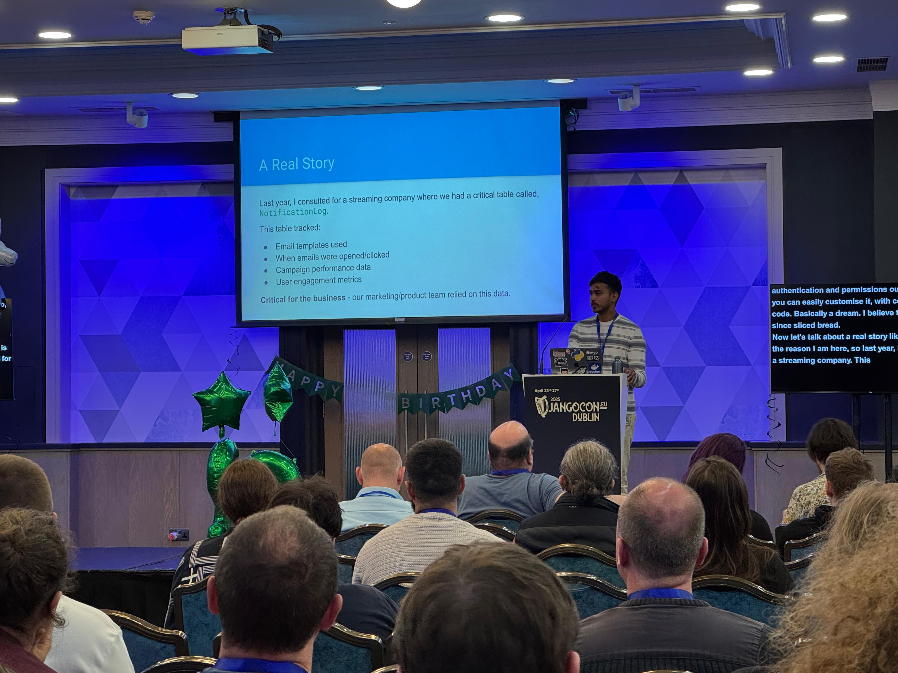

_My thoughts on my first ever DjangoCon._

In April 2025, I attended DjangoCon Europe in Dublin. This was my first DjangoCon experience, both as an attendee and as
a speaker, and it was truly memorable.

## My Talk on Scaling Django Admin

I had the opportunity to present a talk on how to scale Django Admin. As someone who has worked with Django for years, I
was excited to share my insights and experiences with the community. Preparing for this talk was both challenging and
rewarding, as it pushed me to organize my thoughts and distill my knowledge into a coherent presentation.

The talk itself went well, I believe, based on the feedback I received, although I was very nervous. The people who have
contributed to Django in recent years were sitting in the front rows, so the pressure was real. Despite my nerves, I was
grateful that I was able to deliver my talk without many issues, and the audience also asked a couple of thoughtful
questions. It's one thing to work with a technology, but it's an entirely different experience to stand in front of a
room full of developers — especially those who helped build the framework — and explain your approach.

## Dublin: The Perfect Host City

Dublin proved to be an excellent location for the conference. The weather was great throughout the event — which is not
always guaranteed in Ireland! Coming from India, where summers can be quite hot, I found Dublin's weather particularly
lovely and refreshing. The city itself has a unique charm, with its historic buildings and vibrant atmosphere.

What stood out most was the warmth and friendliness of the people. From the hotel staff to random strangers in pubs,
everyone was incredibly welcoming and helpful. This hospitable environment extended to the conference as well.

## The Django Community

One of the most striking aspects of DjangoCon was the community. Everyone was incredibly welcoming and supportive,
especially to first-time speakers like myself. There's often some anxiety about how you'll be received in a new
community, but those fears were quickly dispelled.

I had the chance to meet many people whose blog posts and tutorials had helped me learn Django over the years. It was
surreal to have face-to-face conversations with developers I had admired from afar. These interactions reinforced what I
already knew: the Django community is special not just because of the technology, but because of the people who make it
what it is.

## A Memorable Moment

The highlight of the conference, for me, came during the after-party. <a href="https://noumenal.es/" target="_blank">
Carlton Gibson</a>, whose work I've long admired, approached me to praise my talk and offered some insightful feedback.
For someone who has learned so much from the Django community, this moment of recognition was incredibly meaningful.

## Final Thoughts

My first DjangoCon experience exceeded all expectations. Beyond the technical knowledge shared in talks and workshops,
the connections made and the sense of belonging to this community were the true highlights.

If you're considering attending or speaking at a DjangoCon in the future, I wholeheartedly encourage you to do so. The
Django community is truly special, and there's nothing quite like experiencing it firsthand.

If you're interested in the content of my talk, I've uploaded the slides to GitHub. They're available
at <a href="https://github.com/sumit4613/djangocon-eu-2025" target="_blank">https://github.com/sumit4613/djangocon-eu-2025</a>.